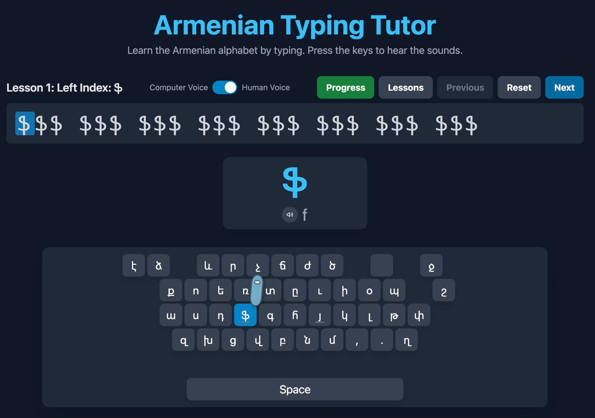

<div align="center">
  
</div>

# 🇦🇲 Armenian Typing Tutor

An interactive desktop application designed to help you master the Armenian keyboard layout. Learn to type in Armenian with guided lessons, progress tracking, and real-time feedback.

## ✨ Features

- **📚 20 Progressive Lessons** - From basic letters to advanced combinations
- **🎯 38 Armenian Characters** - Complete coverage of Eastern Armenian alphabet
- **📊 Progress Tracking** - Monitor your typing speed, accuracy, and mistakes
- **🎨 Dark Mode UI** - Modern, eye-friendly interface
- **⌨️ Visual Keyboard** - Interactive keyboard with finger positioning guides
- **🔊 Audio Support** - Voice toggle for pronunciation guidance
- **💾 Local Storage** - Your progress is saved automatically
- **🖥️ Cross-Platform** - Native macOS app (Intel & Apple Silicon)
- **📱 PWA Support** - Install as a web app on any device (Android, iOS, Desktop)

## 🚀 Quick Start

### Prerequisites
- Node.js (v16 or higher)
- npm or yarn

### Installation

1. **Clone the repository:**
   ```bash
   git clone https://github.com/7smd7/Armenian-Typing-Tutor.git
   cd Armenian-Typing-Tutor
   ```

2. **Install dependencies:**
   ```bash
   npm install
   ```

3. **Run in development mode:**
   ```bash
   npm run dev
   ```

4. **Build and run the desktop app:**
   ```bash
   npm start
   ```

## 📦 Building for Distribution

### macOS App
```bash
npm run dist:mac
```

This creates two DMG installers in the `release/` folder:
- `Armenian Typing Tutor-1.0.0.dmg` (Intel Macs)
- `Armenian Typing Tutor-1.0.0-arm64.dmg` (Apple Silicon Macs)

## 🎯 How to Use

1. **Select a Lesson** - Choose from 20 progressive lessons in the menu
2. **Follow the Guide** - Type the highlighted character shown on screen
3. **Watch Your Progress** - View your WPM (Words Per Minute) and accuracy
4. **Check Finger Position** - Use the visual keyboard guide for proper typing technique
5. **Track Your Journey** - Access the Progress Dashboard to see your overall statistics

## 📖 Lesson Structure

The app includes 20 carefully designed lessons covering:

- **Lessons 1-10**: Individual Armenian letters (ա, բ, գ, դ, ե, զ, է...)
- **Lessons 11-15**: Capital letters and common combinations
- **Lessons 16-20**: Punctuation, numbers, and advanced practice

Each lesson includes:
- Character introduction with transliteration
- Guided typing practice
- Real-time accuracy feedback
- Speed measurement (WPM)

## 🛠️ Tech Stack

- **Frontend**: React 19, TypeScript, Tailwind CSS
- **Build Tool**: Vite
- **Desktop**: Electron
- **Packaging**: electron-builder
- **Icons**: Custom SVG icons converted to .icns

## 📱 Progressive Web App (PWA)

This app can be installed as a native-like web application on any device:

### Installation
1. **Visit the website**: [armenian.mohammaddaryani.dev](https://armenian.mohammaddaryani.dev)
2. **Install Prompt**: Look for the "📱 Install App" button or browser install prompt
3. **Add to Home Screen**: Follow your browser's instructions to install

### Features
- **Offline Support**: Works without internet connection
- **Native Experience**: Launches like a native app
- **Auto-updates**: Automatically updates when new versions are available
- **Cross-platform**: Works on Android, iOS, Windows, macOS, and Linux

### Browser Support
- **Chrome/Edge**: Install button appears automatically
- **Firefox**: Manual installation via address bar menu
- **Safari (iOS)**: Share button → "Add to Home Screen"
- **Samsung Internet**: Install button in menu

## 📊 Progress Tracking

Your learning progress is automatically saved locally, including:
- ✅ Completed lessons
- 📈 Typing speed (WPM)
- 🎯 Accuracy percentage
- ❌ Mistake tracking
- 📅 Session timestamps

## 🎨 Customization

- **Dark Mode**: Automatically adapts to your system preferences
- **Voice Control**: Toggle audio guidance on/off
- **Keyboard Visualization**: See finger positions for each key

## 🤝 Contributing

Contributions are welcome! Please feel free to submit a Pull Request.

## 📄 License

This project is open source and available under the [MIT License](LICENSE).

## 🙏 Acknowledgments

- Armenian alphabet data and transliteration guides
- Electron community for the amazing desktop framework
- React and TypeScript for the robust development experience

---

**Հայերեն ստեղնաշարով սովորիր մուտքագրել!** 🇦🇲

*Learn to type with the Armenian keyboard!* 
